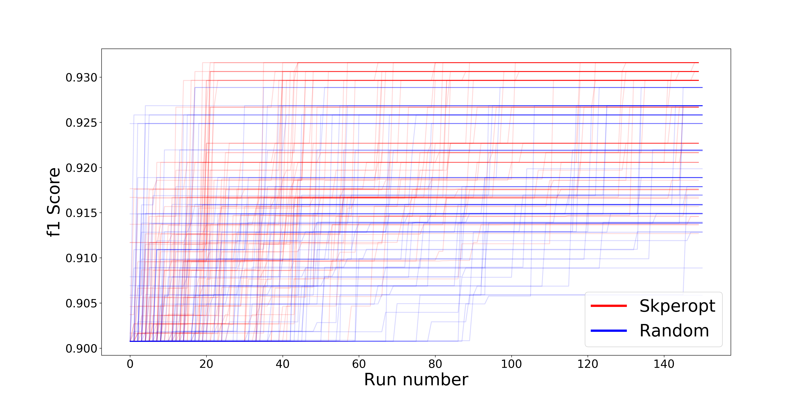

# Skperopt
A hyperopt wrapper - Simplifying hyperparameter searching with Sklearn style estimators.

Works with either classification evaluation metrics "f1", "auc" or "accuracy" or regression "rmse" and "mse".

## Installation:

```
pip install skperopt
```

## Usage:

Just pass in an estimator, a parameter grid and Hyperopt will do the rest. No need to define objectives or write hyoperopt specific parameter grids. 

### Recipe (Vanilla Flavour):

- [x]  Import skperopt
- [x]  Initalize skperopt 
- [x]  Run skperopt.HyperSearch.search
- [x]  Collect the results

Code example below.

```python
import pandas as pd
import numpy as np
import skperopt as sk
from sklearn.datasets import make_classification
from sklearn.neighbors import KNeighborsClassifier

#generate classification data
data = make_classification(n_samples=1000, n_features=10, n_classes=2)
X = pd.DataFrame(data[0])
y = pd.DataFrame(data[1])

#init the classifier
kn = KNeighborsClassifier()
param = {"n_neighbors": [int(x) for x in np.linspace(1, 60, 30)],
         "leaf_size": [int(x) for x in np.linspace(1, 60, 30)],
         "p": [1, 2, 3, 4, 5, 10, 20],
         "algorithm": ['auto', 'ball_tree', 'kd_tree', 'brute'],
         "weights": ["uniform", "distance"]}


#search parameters
search = sk.HyperSearch(kn, X, y, params=param)
search.search()

#gather and apply the best parameters
kn.set_params(**search.best_params)

#view run results
print(search.stats)


```

## HyperSearch parameters

* **est** (*[sklearn estimator]* required) 
> any sklearn style estimator

* **X** (*[pandas Dataframe]* required) 
> your training data

* **y** (*[pandas Dataframe]* required) 
> your training data

* **params** (*[dictionary]* required) 
> a parameter search grid 

* **iters** (default 500 *[int]*) 
> number of iterations to try before early stopping

* **time_to_search** (default None *[int]*) 
> time in seconds to run for before early stopping (None = no time limit)

* **cv** (default 5 *[int]*) 
> number of folds to use in cross_vaidation tests

* **scorer** (default "f1" *[str]*) 
> type of evaluation metric to use - accepts classification "f1","auc","accuracy" or regression "rmse" and "mse"

* **verbose** (default 1 *[int]*) 
> amount of verbosity 

         0 = none 
         
         1 = some 
         
         2 = debug

* **random** (default - *False*) 
> should the data be randomized during the cross validation

* **foldtype** (default "Kfold" *[str]*) 
> type of folds to use - accepts "KFold", "Stratified"

## HyperSearch methods 

* **HyperSearch.search()** (None) 
> Used to search the parameter grid using hyperopt. No parameters need to be passed to the function. All parameters are set during initialization.


# Testing

With 100 tests of 150 search iterations for both RandomSearch and Skperopt Searches.

Skperopt (hyperopt) performs better than a RandomSearch, producing higher average f1 score with a smaller standard deviation.




### Skperopt Search Results 

f1 score over 100 test runs:

> Mean **0.9340930**

> Standard deviation **0.0062275**


### Random Search Results

f1 score over 100 test runs 

> Mean **0.927461652**

> Standard deviation **0.0063314**


----------------------------------------------------------------------------


## Updates

### V0.0.7

* Added **FIXED** RMSE eval metric 

* Added MSE eval metric 
         
